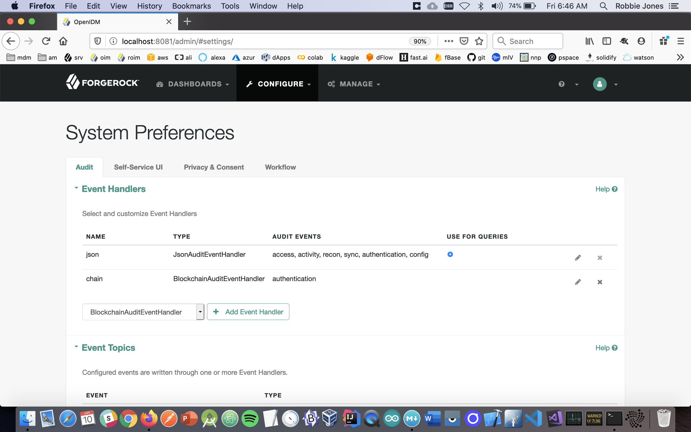
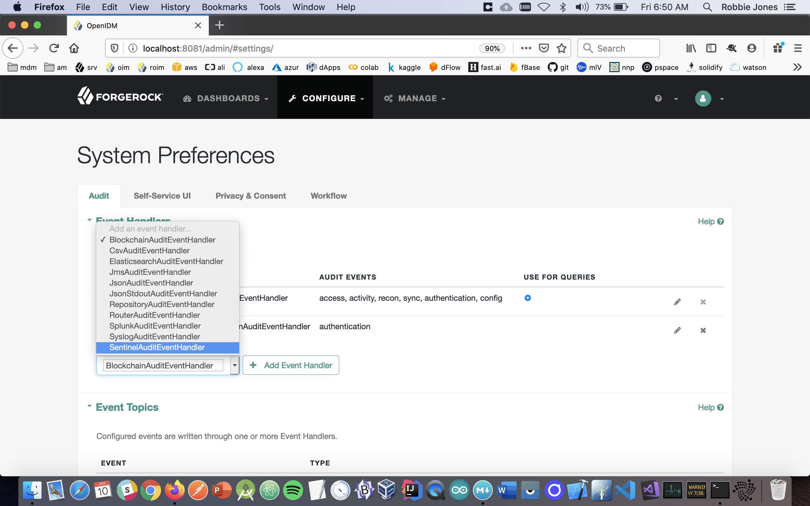
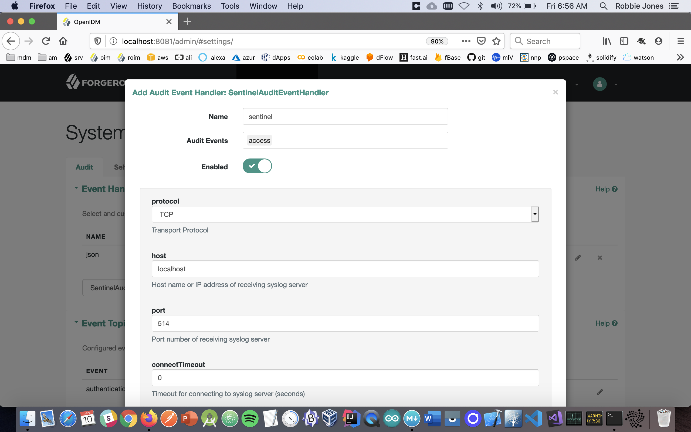
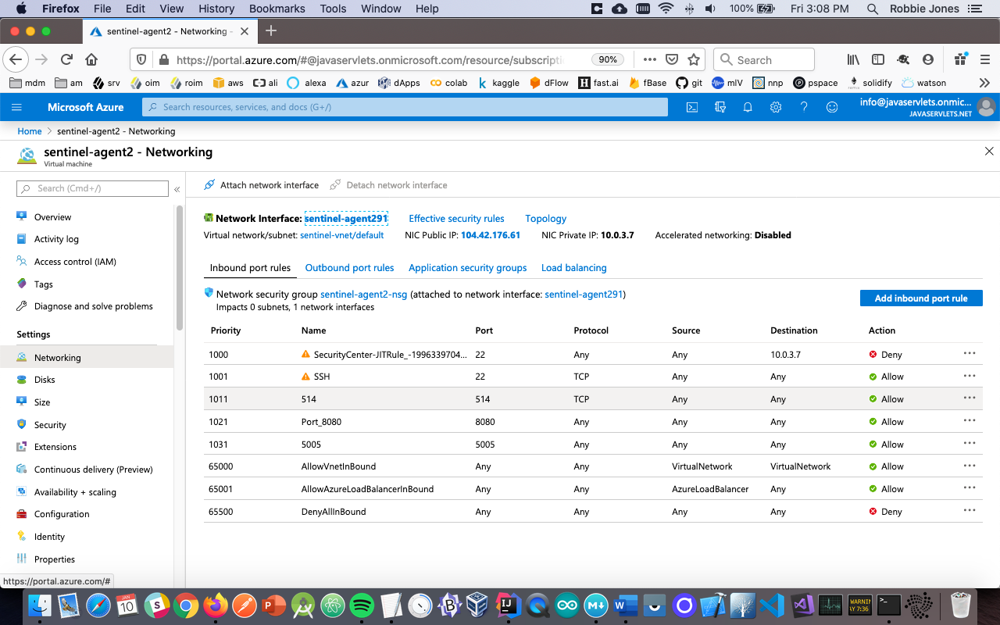

## ForgeRock Common Audit (CAUD) for Sentinel

If you are not already familiar with the [ForgeRock CAUD] (https://www.forgerock.com/platform/common-services/common-audit) it is a framework for audit event handlers that are plugged in to our individual products. The handlers record events, logging them for example into files, relational databases, or [syslog](https://en.wikipedia.org/wiki/Syslog).

Speaking of syslog, Microsoft recently released [Sentinel] (https://azure.microsoft.com/en-us/services/azure-sentinel/), their Security Information and Event Manager (SIEM) for the Azure Cloud that uses syslog extensively. With Sentinel, events for any system under an Azure cluster that want to be monitored need to be sent to a designated 'Sentinel agent' machine in order to be processed.

Microsoft provides an automated configuration script during the Sentinel agent setup in order to listen to Syslog messages; this makes one integration with the CAUD almost trivial given that one of the dozen or so CAUD event handlers we ship out of the box is for specifically for syslog.

A somewhat deeper integration can be achieved when systems report metrics to Sentinel via the [Common Event Format](https://ldapwiki.com/wiki/Common%20Event%20Format) (CEF). Since Microsoft has a number of pre-built visualizations, dashboards, alerts that work out of the box on CEF data, we have provided the CEF-based event handler published here in this repository in order to seamlessly leverage the CEF artifacts Microsoft has already configured.

Note: The instructions for configuring the CAUD vary slightly from product to product; in the interest of simplicity, the below is for openidm running on Ubuntu; the Sentinel agent instructions below are also for Ubuntu.

#### Steps to build
- download or clone this repo
- (optional: modify the CEF header at line 106 of SentinelAuditEventHandler.java to reflect your company name, version etc.)
- run 'mvn clean package -DskipTests' from this same level directory
- if any dependency checks fail, verify your credentials used to access backstage.forgerock.com

##### Steps to configure on openidm machine
- stop openidm if it is running
- copy the forgerock-audit-handler-sentinel-1.0.0.jar file that you just used maven to build to your openidm/bundle directory
- add to your openidm/conf/audit.json the entry "org.forgerock.audit.handlers.sentinel.SentinelAuditEventHandler" to the existing "availableAuditEventHandlers" field
- restart openidm

##### Steps to configure in openidm UI
- navigate to http://yourhost:8080/admin/#settings/ in order to configure your System Preferences

- from the pull down next to 'add event handler, select the Sentinel one and then click on 'add event handler'

- in the ensuing dialog, give it a unique name and all the audit events you want sent to Sentinel (ie, 'authentication')
- 
- toggle the 'enabled' radio button, and enter 
- a) the IP address of your Sentinel agent 
- b) '514' for the port number
- c) '1000' for the timeout value
- d) click OK at the bottom of the dialog

- note the 'pending changes' banner, so scroll to the bottom and click 'Save'

#### Steps to configure in Azure Sentinel
Follow the very thorough configuration steps provided by [Microsoft] (https://docs.microsoft.com/en-us/azure/sentinel/connect-common-event-format)

#### Quick test to verify the above is working
- assuming you specified 'authentication' per the example above, log out or log into openidm
- verify a message starting with "CEF:1" has been written to /var/log/syslog on the Sentinel agent
	
	#### Things to try if you don't see that message on the openidm machine
	- check for errors in (path to openidm)/logs/(latest log)
	- check for errors in the terminal window from where you started openidm
	
	#### Things to try if you don't see that message on the Sentinel agent
	- verify that a command line test of 
	`nc -t (your IP address) 514 <<< "CEF:0|ForgeRock Inc" & 
	`results in the message being logged at /var/log/syslog
	- check for errors in /var/log/sentinel-agent/rsyslogd.log
	- verify port 514 is open on the Sentinel agent; if not, create configuration rule so to open it

	- insert from the https://github.com/javaservlets/SentinelAuditEventHandler/tree/master/misc/rsyslog.conf file here in this repo lines 29-33 into your /etc/rsyslog.conf, and make sure lines 43 and 46 match your values (if changes are made, you must run 'sudo service rsyslog restart')
	
#### Deeper test to verify the above is working
- to verify that your CEF messages are being processed by Sentinel, pay close attention to step 5 when running their [canned reports] (https://techcommunity.microsoft.com/t5/azure-sentinel/best-practices-for-common-event-format-cef-collection-in-azure/ba-p/969990)